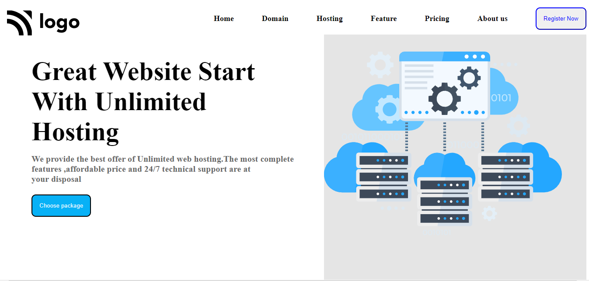

# Project- 11 HTML and CSS

# [Link of live Project](https://hostingdeveloper.netlify.app/)

# What I learnt here from this project-

- I have very good experience from developing this awosome web project.
- I have learnt more about Html and Css in the depth of knowledge.

# How many time to take develop this web page.

-I have spent almost 5 hours by my side to develop this Webpage project